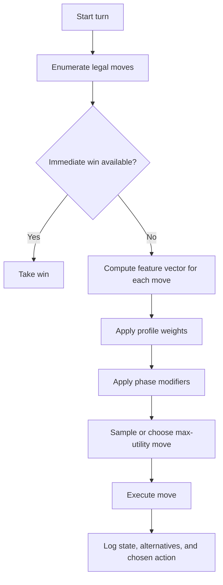

# Playable AI Strategy Space for Virtual Wahoo

## Executive summary

Wahoo is not a deep hidden-information game, but it is not strategically empty either. Under the uploaded rules, most meaningful turns reduce to a small set of repeated tensions: deploy another marble or push a current runner, attack or reduce exposure, take the center shortcut or avoid its volatility, and convert toward home or keep disrupting opponents. Because the rules also force a move whenever one is legal, style should be inferred from *opportunity-conditioned* choices rather than raw move counts. fileciteturn0file0

Blocking exists in this baseline. Stacking does not. The uploaded rules say you cannot land on or pass over your own marbles, so the practical control tactic is traffic shaping: keeping your start square, outer lane, and home row from clogging each other. That is the real analogue of “blocking/stacking” for this ruleset. fileciteturn0file0

There is no single fully stable public “standard Wahoo” ruleset. The uploaded rules define one clear local standard, but published Wahoo and Aggravation sources diverge on jumping conventions, shortcut geometry, shortcut exits, and team play. Wahoo Games’ public snippets mention jumping over marbles and center exits on 1 or 6; official Aggravation rules from Hasbro and Winning Moves use different shortcut structures and explicitly allow opponent-jumping while restricting own-marble jumping; Wahoo Games’ FAQ also acknowledges family-rule variation on whether players may jump their own marbles. Any serious AI implementation should therefore externalize rule flags instead of hard-coding one universal move generator. citeturn26search0turn27search10turn18search0turn19search0turn17view0turn17view1turn21search0

The cleanest AI design is a single competent policy conditioned by an interpretable style vector. This report proposes ten core strategy dimensions, eight distinct playstyle profiles, a probe-based validation framework, and a logging schema built to infer human style and tune AI weights without conflating preference with forced play.

## Rules baseline and modeling assumptions

BoardGameGeek summarizes Wahoo as a long-played American Southwest marble-race game and identifies Aggravation as a simplified commercial relative. That relationship matters because Aggravation’s official rule sheets are useful as nearby primary references for race/capture dynamics and variant sensitivity, even though they are not identical to the uploaded baseline. citeturn12search7turn17view0turn17view1

For this report, the uploaded `HOW_TO_PLAY.md` is the controlling ruleset: four players, four marbles each, one six-sided die, mandatory movement if legal, exit from base on 1 or 6, extra turns on 6 without limit, no landing on or passing over your own marbles, exact-count movement in the home row, and an optional single-occupancy center shortcut available only within the first six squares after leaving base, with exit on a 1. Home slots do not need to be filled in order; the game ends as soon as the fourth marble enters home. fileciteturn0file0

| Rule area | Baseline used in this report | Published variation that should become a rule flag |
|---|---|---|
| Turn economy | Must move if legal; start from base on 1 or 6; 6 grants another roll. fileciteturn0file0 | Commercial Wahoo and Aggravation sources broadly agree on 1-or-6 starts and extra turns on 6. citeturn2search0turn22search0turn17view0 |
| Opponent interaction on the track | Passing over opponents has no effect; exact landing captures and sends the target back to base. fileciteturn0file0 | Wahoo Games snippets say a player may jump over marbles; Hasbro Aggravation counts jumping an opponent as one point of movement. Threat maps therefore depend on the active jump rule. citeturn26search0turn17view0 |
| Own-marble interaction | You cannot land on or pass over your own marbles. fileciteturn0file0 | Hasbro Aggravation also disallows jumping your own marbles, but Wahoo Games’ FAQ says some families allow it. This must be a flag, not an assumption. citeturn17view0turn21search0 |
| Shortcut geometry | One-shot-per-marble center access from the first six squares after leaving base; exact count required; center holds one marble; entering an occupied center bumps the occupant; exit requires a 1. fileciteturn0file0 | Current Wahoo Games snippets describe exact-roll center shortcuts with different entry/exit geometry, including exits on 1 or 6; Aggravation uses star shortcuts and/or center super-shortcuts depending on edition. citeturn18search0turn19search0turn27search10turn6view0turn17view1 |
| Home-row behavior | Turning into home is mandatory from the last pre-home square; exact roll required to land in a specific home slot; home is safe; slots need not be filled in order. fileciteturn0file0 | Official Aggravation rules also require exact count into home and forbid treating home as pass-through space. citeturn17view1 |
| Player mode | Four-player clockwise free-for-all is assumed here. fileciteturn0file0 | Published Wahoo and Aggravation sources also include partners/team play. If you enable those modes, additional support heuristics are required. citeturn12search2turn17view1 |

The uploaded rules do **not** specify a total ring length, and public Wahoo/Aggravation boards vary by topology and player count. The scenario bank below therefore uses normalized local coordinates rather than a fixed absolute hole count. fileciteturn0file0 citeturn12search7turn17view1

## Strategy catalogue

The catalogue below is intentionally built around **discretionary** decision points. If a move is forced, it is not evidence of style. This matters because the uploaded rules explicitly require a legal move whenever one exists. Community discussions around Wahoo/Aggravation repeatedly surface the same diagnostic trade-offs: whether a 6 should release another piece or advance/capture with an existing one, whether shortcuts can bypass ordinary blocks, and how home-row ordering interacts with the inability to jump your own marbles. Those are exactly the tensions worth encoding as AI features. fileciteturn0file0 citeturn15search3turn14search4turn15search9turn11search5

| Primitive | Meaning |
|---|---|
| **Start-opportunity** | A roll for which exiting base is legal under the active rules. In the uploaded rules, that is 1 or 6. fileciteturn0file0 |
| **Center-opportunity** | A legal exact-count center entry in the one-shot early shortcut window. fileciteturn0file0 |
| **Threatened marble** | A marble that at least one opponent acting before your next turn can capture under the current jump/capture rules. |
| **Discretionary turn** | A turn with at least two legal moves. Style metrics should focus here because legal movement is mandatory. fileciteturn0file0 |
| **Finish-vs-fight state** | A state where at least one home-progress move and at least one capture or denial move are both legal. |

### Tempo and board-shape heuristics

| Strategy | Definition | If/then decision rule | Typical triggers | Example | Pros | Cons | Detectable log metric |
|---|---|---|---|---|---|---|---|
| **Exit pressure** | Increase the number of active marbles early to widen future choice sets. | If a start-opportunity exists and active marbles are below a target count, exit from base unless a winning home move or clearly superior capture exists. | Opening turns; after one of your marbles is sent back; when only one marble remains active. | State `You [B,B,R6,R18]`, roll `1`: choose `B→R1` instead of `R18→R19`. | More legal options later; faster recovery; broader board presence. | More exposed marbles; slower single-runner tempo. | **StartExitRate** = exits chosen / discretionary start-opportunities. Also track early active-marble average and re-entry latency after being captured. |
| **Single-runner bias** | Concentrate moves on the furthest-progress marble to race one piece home quickly. | If one marble is materially ahead or can exploit an immediate shortcut/home-turn payoff, advance it unless another move avoids a much larger tactical loss. | Near shortcut entry; near home turn-in; low congestion; few threats. | State `You [B,B,R8,R24]`, roll `4`: choose `R24→R28` over starting a new marble. | Fastest first-finish path; maximizes shortcut payoff. | Catastrophic if the runner is captured; easy to target. | **RunnerMoveShare** = moves on furthest marble / discretionary turns; **RunnerConcentrationIndex** = furthest-marble progress / total own progress. |
| **Spread portfolio** | Keep two to four marbles active and progress broadly distributed. | If a lagging or base marble can be improved without giving up a big tactical swing, prefer equalization over further concentration. | Multiple marbles in base; one piece becoming overexposed; midgame flexibility needs. | State `You [B,R4,R18,R19]`, roll `1`: choose `B→R1` instead of `R19→R20`. | Robust against captures; more attack vectors; fewer dead-end rolls. | Slower direct race; can waste tempo if spread too evenly. | **SpreadEntropy** of progress across marbles; active-marble count; **LaggerActivationRate**. |
| **Shortcut eagerness** | Treat the center shortcut as the default high-value move when legal. | If a center-opportunity exists and it does not forfeit an immediate win or critical defensive move, take the center. | Early squares; center empty; a big path-length gain is available. | State `You [B,B,R6,R18]`, roll `1`: choose `R6→C`. | Large positional jump; can create sudden win threats. | Volatile; center can be contested; exit roll is constrained. | **CenterEntryRate** = center entries / discretionary center-opportunities; **CenterRealizedGain**; **CenterLossRate**. |
| **Flow control** | Preserve future mobility by clearing self-blocks and keeping start/home entrances usable. | If one legal move materially reduces future self-blocking or opens a clogged lane, prefer it over equivalent raw progress. | Own marbles 1–6 apart on same lane; start square occupied; partial home-row congestion. | State `You [B,R9,R12,R31]`, roll `3`: choose `R12→R15` so `R9` is no longer trapped by many future rolls. | Fewer forced low-value turns; smoother endgame; more consistent legal-move availability. | Can look passive in the short run. | **SelfBlockIndex** before/after move; **FlowGain** = expected increase in legal future moves over sampled next-roll sets; start-square occupancy duration. |

### Interaction and finishing heuristics

| Strategy | Definition | If/then decision rule | Typical triggers | Example | Pros | Cons | Detectable log metric |
|---|---|---|---|---|---|---|---|
| **Capture aggression** | Prioritize resetting opponents by exact landing captures. | If a capture is legal, take it unless it costs an immediate win or creates obviously losing exposure. When multiple captures exist, target the leader or the highest-progress victim first. | Exact capture lines; leader in range; victim near home; start-square attacks. | State `You [B,B,R7,R22]`, leader is 6 ahead of `R7`, roll `6`: choose capture over exit. | Biggest tempo swing available; slows leaders; creates comeback chances. | Can overexpose the attacker; may prolong the game instead of finishing it. | **CaptureConversion** = captures chosen / discretionary capture opportunities; **LeaderTargetShare**; **RecaptureRate** on the moved marble. |
| **Safety first** | Minimize short-horizon capture risk and avoid unnecessary volatility. | If a threatened marble can be moved out of likely capture range or into home, do so unless another move offers much larger value. | Marble inside 1–6 reach of upcoming opponents; contested center; exposed runner. | State `You [B,R12,R24,R30]`, next opponent is 4 behind `R24`, roll `4`: choose `R24→R28`. | Reduces catastrophic setbacks; steady, low-volatility progress. | Misses attacks; can drift into passivity. | **ThreatEscapeRate** = threat-reducing choices / threat-escape opportunities; mean post-move exposure; inverse **RiskAcceptedRate**. |
| **Center denial** | Use the center not just for progress, but to eject or preempt opponents exploiting it. | If a legal center entry would bump an occupant or clearly deny a leader’s shortcut plan, prioritize it over similar-value racing moves. | Opponent in center; leader approaching center window; high-value denial chance. | State `You [B,B,R6,R18]`, leader sits in `C`, roll `1`: choose `R6→C` to eject them. | Excellent anti-leader tool; punishes greedy shortcut use. | Can distract from your own finish. | **CenterDenyRate** = center-denial choices / center-denial opportunities; opponent-center bump count; **LeaderDisruptionScore**. |
| **Home-lane engineering** | Optimize exact home placement so the home row does not stall itself. | When a home move is legal, prefer the deepest legal slot or move an inside-home marble deeper if doing so opens stronger future entries. | Partial home row; turn-in marble waiting; multiple exact-home options. | State `You [H1,H2,R20,T]`, roll `2`: `T→H2` is blocked, so choose `H2→H4` rather than a minor ring move. | Converts leads cleaner; reduces wasted home-entry opportunities. | Board-control tempo may stall while you “tidy” home. | **HomeDepthPreference** = chosen depth / max legal depth; **HomeReliefRate**; count of failed home opportunities caused by own congestion. |
| **Finish-over-fight** | Bias late-game choices toward certain home progress instead of continued disruption. | In a finish-vs-fight state, prefer the home-progress move unless failing to disrupt would allow a near-certain opponent win before your next turn. | Two or more marbles already home; last two pieces nearing turn-in; low marginal value of extra captures. | State `You [H1,H2,T,R10]`, opponent leader is exactly 4 ahead of `R10`, roll `4`: choose `T→H4` if your style is finishing-oriented. | Better lead conversion; less self-sabotage in endgame. | Can ignore necessary denial in razor-close races. | **FinishPriorityRate** = home-progress choices / finish-vs-fight opportunities; **WinConversionTurns** after reaching 2+ home marbles. |

Risk tolerance is best treated as a **cross-cutting scalar**, not as a separate primary strategy. High-risk behavior is mostly the result of high weights on **single-runner bias**, **capture aggression**, and **shortcut eagerness**, combined with a low weight on **safety first**. Low-risk behavior is the reverse.

A second useful refinement is a **phase switch** rather than a separate strategy: many strong players spread early, then collapse into single-runner or finish-over-fight behavior once a leading marble or a clean home path emerges. In other words, “spread vs runner” is often a stage-dependent preference, not a permanent identity.

## Playstyle profiles

Use hard guardrails first, then style. Immediate wins should always outrank style expression. After that, score legal moves with a weighted utility function over the ten strategy dimensions. A simple, interpretable version is:

\[
U(a\mid s,p)=\sum_i w_{p,i}\,f_i(a,s)+\phi(\text{phase},s)+\epsilon
\]

Where \(f_i(a,s)\) is the feature value of action \(a\) in state \(s\), \(w_{p,i}\) is the profile weight, \(\phi\) is a phase-specific modifier, and \(\epsilon\) is optional softmax noise to avoid robotic determinism.



**Weight legend:** `DEP` deployment, `RUN` single-runner bias, `SPR` spread, `CAP` capture aggression, `SAFE` safety first, `CTR` shortcut eagerness, `DEN` center/leader denial, `FLOW` flow control, `HOME` home-lane engineering, `FIN` finish-over-fight.

| Profile | Personality | DEP | RUN | SPR | CAP | SAFE | CTR | DEN | FLOW | HOME | FIN |
|---|---|---:|---:|---:|---:|---:|---:|---:|---:|---:|---:|
| **Sprinter** | Impatient racer; wants one marble moving fast and accepts real risk for tempo. | 0.4 | 1.0 | 0.2 | 0.4 | 0.2 | 0.9 | 0.3 | 0.4 | 0.5 | 0.9 |
| **Swarm** | Floods the board with active marbles and wins by constant option pressure. | 1.0 | 0.2 | 1.0 | 0.5 | 0.4 | 0.4 | 0.4 | 0.8 | 0.5 | 0.6 |
| **Assassin** | Predatory, disruption-heavy, leader-hunting, willing to delay its own race to reset others. | 0.5 | 0.4 | 0.4 | 1.0 | 0.2 | 0.5 | 0.9 | 0.5 | 0.3 | 0.4 |
| **Shortcut Gambler** | High-variance, shortcut-obsessed, thrilling when it works and ugly when it fails. | 0.7 | 0.8 | 0.3 | 0.6 | 0.1 | 1.0 | 0.6 | 0.2 | 0.4 | 0.5 |
| **Tortoise** | Low-volatility, exposure-aware, wins by refusing to donate easy captures. | 0.4 | 0.3 | 0.6 | 0.2 | 1.0 | 0.1 | 0.5 | 0.9 | 0.9 | 0.8 |
| **Gatekeeper** | Controls key lanes, contests center use, and punishes overextension. | 0.5 | 0.3 | 0.5 | 0.7 | 0.7 | 0.4 | 1.0 | 0.8 | 0.5 | 0.6 |
| **Endgame Engineer** | Technical converter; thinks ahead about flow, home structure, and closing cleanly. | 0.4 | 0.4 | 0.5 | 0.2 | 0.8 | 0.2 | 0.3 | 1.0 | 1.0 | 1.0 |
| **Balanced Pragmatist** | Context-sensitive all-rounder with no single obsession. | 0.6 | 0.5 | 0.6 | 0.6 | 0.6 | 0.5 | 0.6 | 0.7 | 0.7 | 0.7 |

These weights should differentiate *style*, not *competence*. Do not make the Assassin weaker by searching less deeply or the Tortoise stronger by giving it extra rollout budget. Different playstyles should come from different utilities over the same legal move set and roughly the same tactical competence envelope.

## Validation scenarios and metrics

Validate style before you validate win rate. A single die and mandatory legal moves create enough variance that short matches can hide whether an AI is actually behaving like a Sprinter, Swarm, or Tortoise. The uploaded rules also make home-slot choice real because home order is unconstrained, and board circumference is left unspecified, so a normalized local notation is the right way to define scenario probes. fileciteturn0file0 citeturn17view1turn12search7

**Scenario notation used below:** `B` = base, `C` = center, `Rk` = ring square \(k\) after leaving your start, `T` = turn-in square just before home, `H1…H4` = home-row slots from entrance to deepest. The “probe roll trace” lists the current roll first, then suggested future own-rolls for deterministic rollout testing.

| Scenario | Sample board state | Probe roll trace | Style signal and expected profile behavior | Primary metric |
|---|---|---|---|---|
| **Center temptation** | `You [B,B,R6,R18]`, center empty. | `1 → 1` | Shortcut Gambler and Sprinter should choose `R6→C` very often; Swarm should often choose `B→R1`; Tortoise should be center-averse unless the board is otherwise quiet. | **CenterEntryRate** |
| **Capture or deploy** | `You [B,B,R7,R22]`; opponent leader is exactly 6 ahead of `R7`; start square free. | `6 → 2` | Assassin and Gatekeeper should heavily prefer the capture; Swarm should show a materially higher exit rate; Balanced Pragmatist should capture more often than not. | **CaptureConversion**, **LeaderTargetShare** |
| **Threat escape** | `You [B,R12,R24,R30]`; next opponent is exactly 4 behind `R24`. | `4 → 3` | Tortoise and Gatekeeper should choose `R24→R28`; Sprinter should be more willing to push `R30`; Assassin may ignore safety if a future hit line is opened. | **ThreatEscapeRate** |
| **Center denial** | `You [B,B,R6,R18]`; opponent leader occupies `C`. | `1 → 4` | Gatekeeper and Assassin should choose `R6→C` to bump; Swarm should more readily exit from base; Endgame Engineer should only deny if the opponent’s shortcut value is truly large. | **CenterDenyRate** |
| **Flow repair** | `You [B,R9,R12,R31]`. | `3 → 2` | Endgame Engineer, Tortoise, and Gatekeeper should choose `R12→R15` to free the lane behind it; Sprinter should be more likely to choose `R31→R34`. | **FlowGain**, **SelfBlockIndex** reduction |
| **Home-lane engineering** | `You [H1,H2,R20,T]`; `T→H2` is blocked. | `2 → 2` | Endgame Engineer should strongly prefer `H2→H4`; Tortoise should also favor clearing home structure; Assassin should more often ignore home repair for outer-board progress. | **HomeReliefRate**, **HomeDepthPreference** |
| **Finish or fight** | `You [H1,H2,T,R10]`; opponent leader is exactly 4 ahead of `R10`. | `4 → 1` | Endgame Engineer and Tortoise should favor `T→H4`; Assassin and Gatekeeper should capture more often; Balanced Pragmatist should depend on whether the opponent is the clear leader. | **FinishPriorityRate** |
| **Spread or runner** | `You [B,R4,R18,R19]`; no immediate threats. | `1 → 5` | Swarm should often choose `B→R1`; Sprinter should often choose `R19→R20`; Balanced Pragmatist should sit between them. | **SpreadEntropy** change, **RunnerMoveShare** |

Use those probes in two ways. First, as **single-step conformity tests**: the AI should choose the profile-typical action with the expected frequency. Second, as **fixed-trace rollout tests**: hold the same future dice seed constant across profiles and compare downstream feature signatures, not just immediate choice.

| Evaluation metric | What it tests | How to compute | Good target |
|---|---|---|---|
| **Scenario conformity** | Does the AI act like the intended profile in diagnostic states? | Percentage of expected actions or expected action distributions across the probe bank. | ≥ 0.75 on profile-diagnostic probes. |
| **Feature-distance fidelity** | Does observed log behavior match target style weights? | RMSE or KL divergence between target opportunity-conditioned feature rates and observed profile rates. | Low and stable across seeds. |
| **Profile distinguishability** | Are profiles actually separable in logs? | Train a classifier on move metrics to predict profile label. | Macro-F1 or AUC ≥ 0.80. |
| **Competence guardrails** | Does style ever override obvious competence? | Immediate-win compliance, illegal-move rate, obvious self-stall rate. | Immediate-win compliance = 100%; illegal-move rate = 0. |
| **Strength parity** | Are styles different without one being accidentally much weaker? | Elo spread across long self-play leagues under equal search budget. | Keep within a design envelope, often ±50–100 Elo if style-only variation is the goal. |
| **Temporal consistency** | Does style persist across phases? | Correlate opening, midgame, and endgame metrics for the same profile. | Positive, stable phase signatures. |
| **Variant robustness** | Does the style survive rule toggles? | Re-run probes under alternate jump/shortcut flags and compare rank order of profile traits. | Trait ordering should mostly survive legal-variant changes. |

One additional sanity requirement is non-negotiable: every profile should take an **immediate winning move** if one exists. Style variety should live below that line, not above it.

## Data collection and logging schema

If the goal is to infer human playstyle and fit AI weights, final outcomes are not enough. You need the full **choice set** on each turn, the active rule flags, and state features for both chosen and unchosen legal moves. Otherwise you cannot tell whether a player preferred aggression, was forced into it, or was playing on a jump-enabled shortcut variant that changed the threat geometry entirely. Because the uploaded rules force legal movement, discretionary and forced turns must also be separated at logging time. fileciteturn0file0 citeturn21search0turn26search0turn17view0turn18search0

| Layer | Required fields | Why it matters |
|---|---|---|
| **Match header** | `game_id`, timestamp, board version, seat order, player count, RNG seed, software version | Reproducibility and correct threat ordering. |
| **Rule flags** | `start_rule`, `extra_turn_rule`, `jump_opponent_rule`, `jump_own_rule`, `capture_rule`, `shortcut_mode`, `shortcut_entry_window`, `center_capacity`, `center_exit_rule`, `home_exact_rule`, `partner_mode` | Style cannot be interpreted correctly unless the active ruleset is explicit. |
| **Turn header** | `turn_idx`, active player, roll value, extra-turn-chain index, legal-move count, forced/discretionary flag | Separates genuine preference from mandatory play. |
| **Board snapshot** | Base count, home count, center occupant, exact marble positions, progress distances, which opponents act before next own turn, current leader estimate | Needed to compute all strategy features, especially risk and denial. |
| **Candidate actions** | One record per legal move: `action_id`, piece id, move type (`EXIT`, `ADVANCE`, `CAPTURE`, `CENTER_ENTER`, `CENTER_EXIT`, `HOME_ENTER`, `HOME_ADVANCE`), from/to positions, target piece if captured, chosen flag | Without unchosen alternatives, preference learning is badly confounded. |
| **Derived action features** | `DEP`, `RUN`, `SPR`, `CAP`, `SAFE`, `CTR`, `DEN`, `FLOW`, `HOME`, `FIN`, plus raw deltas such as threat reduction, self-block reduction, home-depth gain, leader disruption, estimated win-probability delta | These are the features the style model will actually fit. |
| **Post-turn snapshot** | Updated board state, captures made, center changes, home changes, turn passed or continued | Lets you verify feature extraction and downstream outcome effects. |
| **Outcome summary** | Winner, finish order, turns elapsed, captures made/suffered, center usage stats, home-stall stats, per-player style metrics | Needed for league evaluation and post-hoc style clustering. |
| **Optional human telemetry** | Think time, hover trails, move previews inspected, undo requests, last aggressor against this player, self-reported style survey | Very useful for inferring human intent, retaliation bias, or engineering-oriented play. |

A minimal **candidate-action record** should look like this:

```json
{
  "turn_idx": 42,
  "active_player": "P2",
  "roll": 6,
  "forced_move": false,
  "rule_flags": {
    "jump_opponent_rule": "pass_no_effect",
    "jump_own_rule": "forbidden",
    "shortcut_mode": "early_window_center",
    "center_exit_rule": "roll_1"
  },
  "pre_state": {
    "own_marbles": ["R7", "R22", "B", "B"],
    "center": null,
    "leader_id": "P4"
  },
  "candidate_actions": [
    {
      "action_id": "a1",
      "type": "EXIT",
      "piece": "M3",
      "to": "R1",
      "features": {
        "DEP": 1.0, "RUN": 0.0, "SPR": 0.8, "CAP": 0.0, "SAFE": 0.2,
        "CTR": 0.0, "DEN": 0.0, "FLOW": 0.3, "HOME": 0.0, "FIN": 0.0
      }
    },
    {
      "action_id": "a2",
      "type": "CAPTURE",
      "piece": "M1",
      "to": "R13",
      "target": "P4_M2",
      "features": {
        "DEP": 0.0, "RUN": 0.4, "SPR": 0.1, "CAP": 1.0, "SAFE": 0.1,
        "CTR": 0.0, "DEN": 0.9, "FLOW": 0.1, "HOME": 0.0, "FIN": 0.2
      }
    }
  ],
  "chosen_action_id": "a2"
}
```

The strongest fitting pipeline is usually:

```mermaid
flowchart LR
A[Raw match logs] --> B[Normalize by rule flags]
B --> C[Enumerate all legal alternatives]
C --> D[Compute candidate features]
D --> E[Fit per-player choice model]
E --> F[Infer style weights]
F --> G[Cluster archetypes or map to named profiles]
G --> H[Instantiate AI personalities]
H --> I[Run scenario probes and self-play leagues]
I --> J[Retune weights and thresholds]
```



For human style inference, a hierarchical multinomial logit or hierarchical Bayesian discrete-choice model is the cleanest starting point because it directly estimates player-level weights from chosen vs unchosen legal moves. If compute is truly unconstrained, you can then layer on max-entropy inverse reinforcement learning or a policy network conditioned on the recovered style vector. The key is not the sophistication of the learner; it is the quality of the logged alternatives and the explicit separation of **rules**, **opportunities**, and **preferences**.

A practical data target is at least **200–500 discretionary decisions per human** plus a probe bank that oversamples rare but diagnostic situations such as contested center entries, finish-vs-fight states, and home-row congestion. Natural gameplay alone will not produce enough of those states quickly enough to fit stable weights.